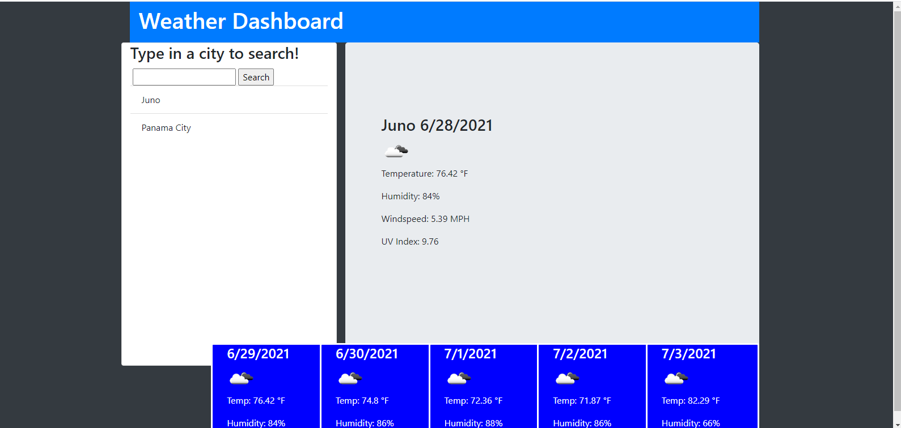

# weather-app
## Description
###### *last updated 6/28/2021

The goal of this project was to create an application that can allow a traveller to look up the weather and projected weather for multiple cities so that they can plan accordingly.
 
 

## Details about project

When the page is loaded, user is presented with an application where user can input a city.   

When the city is submitted, the current weather is loaded, as well as the future conditions for that city.

Then that city is added to the search history

When viewing current weather conditions for that city
user is presented with the city name, the date, an icon representation of weather conditions, the temperature, the humidity, the wind speed, and the UV index.

When user views the UV index, user is
supposed to be presented with a color that indicates whether the conditions are favorable, moderate, or severe.

When viewing the weather conditions for that city
user is presented with a 5-day forecast that displays the date, an icon representation of weather conditions, the temperature, the wind speed, and the humidity.

When user clicks on a city in the search history user will again presented with current and future conditions for that city

 
 
 

[Deployed website on Github](https://roomsiejones.github.io/weather-app/)

[Github Repository Link](https://github.com/roomsiejones/weather-app)

